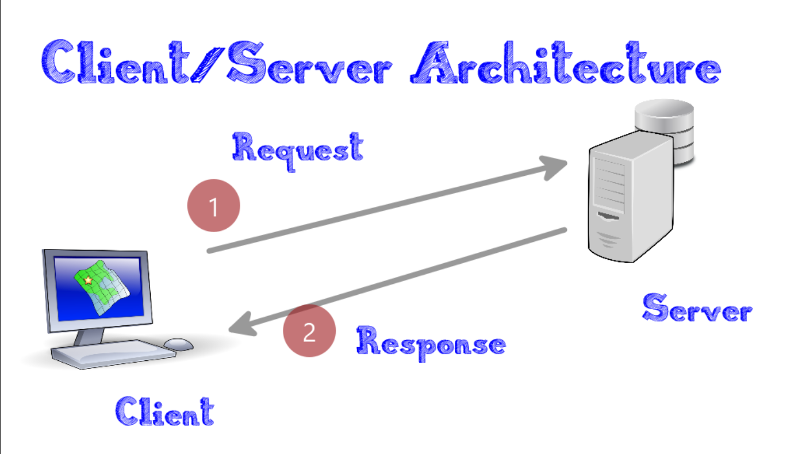

# Client-Server-Architecture-implementation-using-MYSQL
# Client-server architecture
Client-server architecture is a computer network architecture in which remote processors (clients) request and receive service from  host computer (server). Client computers provide an interface to allow users to request services of the server and to display the server response while the Servers wait for clients requests and then respond to them. Ideally, a server provides a standardized transparent interface to clients so that clients need not be aware of the specifics of the system, either the hardware and software, that is providing the service. Clients are often situated at workstations or on personal computers, while servers are located elsewhere on the network, usually on more powerful machines.

## EC2 instance
An Amazon EC2 (Elastic Compute Cloud) instance is a virtual server in the Amazon Web Services (AWS) cloud. EC2 instances provide scalable computing capacity in the form of virtual machines. its used to configure virtual servers in the cloud. These virtual servers, known as instances, can be used for various applications, including hosting websites, running applications, and processing data

## Edit server Inbound rule
Inbound rule control incoming traffic to EC2 instances. The rules are configured within the associated security groups, which act as virtual firewalls for the created instances. Each rule specifies the allowed sources, IP addresses, and protocols for incoming traffic. Protocol:TCP,  Port range:80, Source: Private IP address of mysql client. Source -0.0.0.0/0 at Port range:80 allowing traffic from any source at port 80.  mysql TCP port is 3306 while ethe clients private IP address is 172.31.44.183

## Sudo apt update
Sudo apt update is used on Debian-based Linux systems, such as Ubuntu, to update the local package index. This command does not upgrade the installed packages but retrieves information about the latest versions of packages available from the repositories configured on your system.

## Sudo apt Install my sql-server
This command is used to install mysql server.This command will prompt  for confirmation before installing the MySQL Server packages. If you are okay with the installation, type 'y' and press Enter. After the installation is complete, you can start the MySQL service

## Sudo Systemctl enable mysql 
This command enables MySQL service to start automatically at boot time. will create the necessary symbolic links to start the MySQL service automatically when the system boots up.

## Sudo Systemctl status mysql 
To check the status of the MySQL service, the status command will provide information on what might be wrong. Depending on the MySQL version and the Linux distribution you in use, the exact service name might vary slightly

## Sudo apt install mysql-client 
The command is used to install the MySQL client on a Debian-based Linux system such as Ubuntu. It installs the MySQL client tools, which allow you to interact with a MySQL server from the command line. Once the installation is complete, you can use the MySQL client to connect to a MySQL server. For example, you can connect to a local MySQL server using  the command – mysql -u username -p

## Sudo vi /etc/mysql/mysql.conf.d/mysqld.cnf

To configure MySQL server to allow connections from remote hosts, we use vim to open the mysqld.cnf file. This command opens the MySQL server configuration file in the vi text editor with elevated privileges. This file is typically used to configure various settings for the MySQL server. In this case, we search for the bind-address and Replace ‘127.0.0.1’ to ‘0.0.0.0’.  After configuring mysql server to allow connections from remote hosts, we need to create a remote user that can access our database from remote hosts.

## Sudo mysql
 This allows you to interact with the MySQL server as the root user or another user with administrative privileges. 
select user,plugin,host from mysql.user; - list all users in our that can access the database. 
CREATE USER 'newuser2'@'private IP address of Client' IDENTIFIED BY 'password2'; - this code is used to create a new user and the password.
mysql -u <user> -h < private ip address-of-the-server> -p  connect to a MySQL server using the MySQL command-line client with specific user credentials and the hostname or IP address of the MySQL server.

To avoid displaying the password as warned, we can use - mysql -h private-IP-address of server -u username -p

